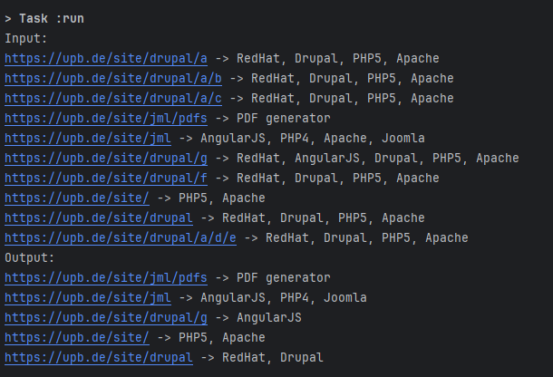
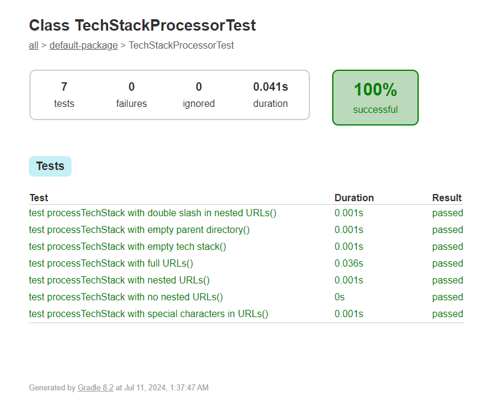

# KotlinChallenge

This project processes a map of URLs and their associated technology stacks, simplifying the technology stacks by removing redundancies inherited from parent directory / URLs.


## Prerequisites

- [Kotlin](https://kotlinlang.org/docs/tutorials/command-line.html)
- [Gradle](https://gradle.org/install/)

## Building the Project

### Clone the repository:
```bash
   git clone <repository-url>
   cd KotlinChallenge
 ```

### Running the Main Application
Execute the following command (in git bash if using windows):
```bash
  ./gradlew run
```
This will compile and run the `Main.kt` file, which contains the entry point of the application. 
The output will display the input and processed technology stacks as output.

### Running Tests
The project also includes unit tests for the TechStackProcessor class. 
To run the tests and generate a report, use the following command:

```bash
  ./gradlew test
```

After running the tests, you can find the test report in the `build/reports/tests/test/index.html file`. 
Open this file in a web browser to view the detailed test results.


## Demo Snapshots
Related Snapshots are Presented below:

### TechStackProcess output


### Unit Test Case Covearge
